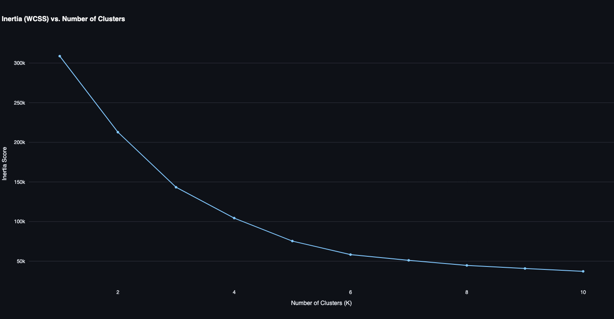
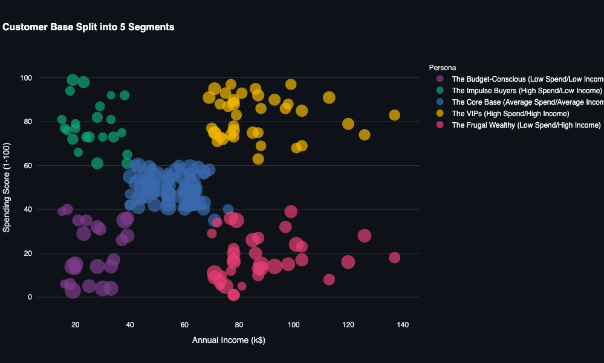

# 🛍️ Intelligent Customer Segmentation Engine

[](https://customer-segmentation-vinay-app.streamlit.app/)  
*(👆 Click the badge above to view the live dashboard!)*


## 📌 Project Overview
This full-stack data science application uses **Unsupervised Machine Learning** to discover hidden patterns in consumer behavior. Built entirely in Python, the engine processes raw mall customer data (Age, Income, and Spending Score) and mathematically groups them into distinct targetable personas.

Instead of arbitrary grouping, this project utilizes the **K-Means Clustering algorithm** backed by the **Elbow Method (WCSS)** to mathematically prove the optimal number of customer segments.

---

## 📊 Visualizing the Data

### 1. Mathematical Proof (The Elbow Curve)
To avoid guessing the number of customer groups, the engine calculates the Within-Cluster Sum of Squares (WCSS) for 1 to 10 clusters. The optimal number of clusters is found at the "elbow" of the curve, which proves that **K=5** is the most mathematically sound choice.



### 2. The AI-Generated Output Graph
The engine automatically maps the AI's predictions onto a 2D scatter plot, comparing Annual Income against Spending Score, with dot size representing the customer's Age. 



---

## 🧠 Business Personas Identified (K=5)
By analyzing the cluster map, the algorithm successfully isolated 5 highly actionable consumer personas:

1. **The VIPs (High Spend / High Income):** Premium targets for luxury campaigns and exclusive loyalty programs.
2. **The Frugal Wealthy (Low Spend / High Income):** Calculated buyers requiring high-ROI or durable product marketing.
3. **The Impulse Buyers (High Spend / Low Income):** Prime demographic for flash sales and trendy, affordable items.
4. **The Budget-Conscious (Low Spend / Low Income):** Focus area for clearance events and essential goods.
5. **The Core Base (Average Spend / Average Income):** The volume drivers, best suited for standard seasonal promotions.

---

## 🛠️ How to Run Locally

If you want to run this engine on your own machine, follow these steps:

**1. Clone the repository**
```bash
git clone https://github.com/vinay98485/customer-segmentation.git
cd customer-segmentation
```

**2. Set up a virtual environment**
```bash
# For macOS/Linux
python -m venv venv
source venv/bin/activate  

# For Windows
venv\Scripts\activate
```

**3. Install dependencies**
```bash
pip install -r requirements.txt
```

**4. Launch the Dashboard**
```bash
streamlit run app.py
```
## 👨‍💻 Author

**Vinay Kumar** 
* **Role:** AI/ML & Python Engineer
